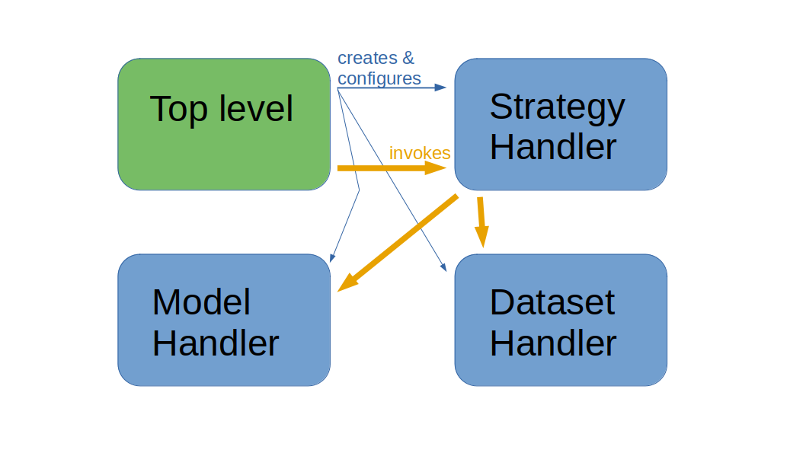

# ALBench
(A)ctive (L)earning (Bench)marking tool:
This is a benchmarking tool for evaluating active learning strategies for machine
learning.

## Overview

The tool takes an input dataset, machine learning model, and active learning strategy
and outputs information to be used in evaluating how well the strategy does with that
model and dataset.  By running the tool multiple times with different inputs, the tool
allows comparisons across different active learning strategies and also allows
comparisons across different models and across different datasets.  Researchers can use
the tool to test proposed active learning strategies in the context of a specific model
and dataset; or multiple models and datasets can be used to get a broader picture of
each strategy's effectiveness in multiple contexts.  As an alternative use case,
multiple runs of the tool with different models and datasets can be compared, evaluating
these models and datasets for their compatibility with a given active learning strategy.

The top-level code creates and configures handlers for the dataset, machine learning
model, and active learning strategy.  Then it invokes the active learning strategy
handler to evaluate the strategy on the dataset using the model.

## Installation
Download the source code using

    git clone https://github.com/DigitalSlideArchive/ALBench.git

or a similar command.  Then install it with `pip` using the name of the directory that you downloaded to:

    pip install ./ALBench

If you wish to use the `al_bench.model` or `al_bench.strategy` subpackage you will also need to install `tensorflow` and `torch`.  If you wish to use `batchbald_redux` you will need that too:

    pip install 'tensorflow<3.0' 'torch<2.0' batchbald_redux

(Torch can be hard to install.  See its installation instructions for help.)

## Using `al_bench`
Import the top-level package and each subpackage you wish to use

    import al_bench as alb
    import al_bench.dataset, al_bench.model, al_bench.strategy, al_bench.factory
    # Use alb.dataset.*, alb.model.*, etc.

See [SimpleExample.ipynb](example/SimpleExample.ipynb) for a simple example of the `dataset`, `model`, and `strategy` subpackages.  See [test/test_0040_factory.py](test/test_0040_factory.py) for an example use of the `factory` subpackage.
